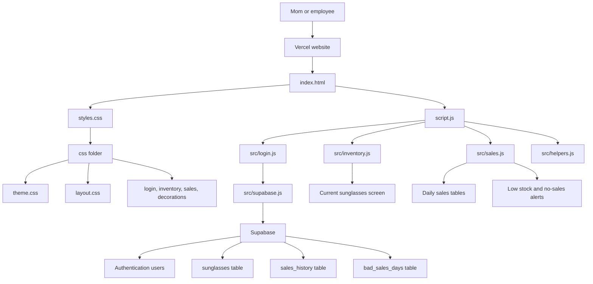

# Sunglasses Inventory System Design

This page shows how the sunglasses inventory app works.

## What Each Part Does

`GitHub`

Stores the app code.

`Vercel`

Puts the app online so it can be opened on phones and computers.

`Supabase`

Stores the real inventory data and handles login.

`index.html`

Builds the app screen.

`styles.css`

Loads the smaller CSS files from the `css` folder.

`css/theme.css`

Stores colors and theme values.

`css/layout.css`

Controls the main page layout.

`css/login.css`

Controls the login screen.

`css/inventory.css`

Controls the sunglasses rectangles.

`css/sales.css`

Controls the daily sales tables.

`css/decorations.css`

Controls flowers, smiley faces, and cute decorations.

`script.js`

Connects the app pieces together.

`src/login.js`

Handles login and auto logout.

`src/supabase.js`

Connects the app to Supabase.

`src/inventory.js`

Shows the current sunglasses and stock buttons.

`src/sales.js`

Shows sales history, popularity, bad-day logic, and no-sales alerts.

`src/helpers.js`

Stores small helper code for dates, IDs, and prices.

## Database Tables

`sunglasses`

Stores each sunglasses type, style number, color, size, price type, stock left, and total sold.

`sales_history`

Stores what was sold each day.

`bad_sales_days`

Stores days that should not count against popularity or no-sales alerts.
